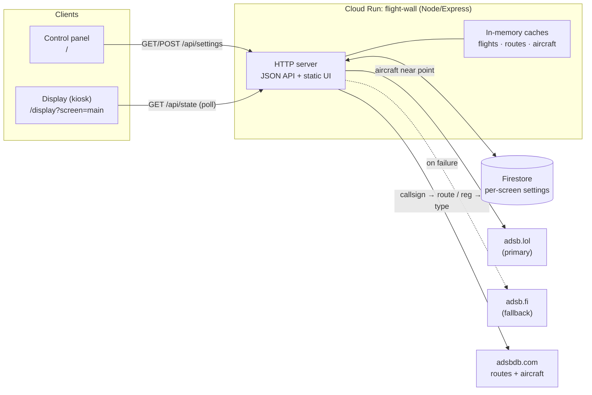

# ✈ Flight Wall

A self-hosted **"flight wall"** — a live, full-screen display of the aircraft flying
over your location, plus a phone-friendly web app to control it. Inspired by
[TheFlightWall](https://theflightwall.com/), but built entirely from free,
key-less data sources and deployable to Google Cloud Run in one command.

Point any full-screen browser — a Raspberry Pi, an Android TV box, an old tablet,
a smart display — at the display URL, and it becomes an airport-style departure
board for the sky above you. Configure it from your phone.

> **Live:** <https://flight-wall-374044178474.us-central1.run.app> — control panel at `/`, display at `/display?screen=main`.

---

## Table of contents

- [What it is](#what-it-is)
- [Features](#-features)
- [Architecture](#-architecture)
- [Data sources](#-data-sources)
- [Quick start (local)](#-quick-start-local)
- [Configuration](#-configuration)
- [Deploy to Google Cloud Run](#-deploy-to-google-cloud-run)
- [Using it](#-using-it)
- [Set up the display device](#-set-up-the-display-device)
- [API reference](#-api-reference)
- [Project structure](#-project-structure)
- [Tech stack](#-tech-stack)
- [Limitations & roadmap](#-limitations--roadmap)
- [License & acknowledgements](#-license--acknowledgements)

---

## What it is

Flight Wall is **two apps in one small container**:

1. **The Display** (`/display?screen=main`) — a full-screen, auto-refreshing board
   showing the flights currently overhead (or a specific flight you're tracking),
   with airline, origin → destination, aircraft type, altitude, speed, heading,
   vertical rate, and distance — plus a live radar. Built for kiosk screens.

2. **The Control Panel** (`/`) — a responsive web page to set your location,
   radius, units, theme, and which flights to watch. It shows a **live preview**
   of exactly what the display is rendering, and pushes changes to the display
   remotely.

Both are served by a single Node.js/Express service. Settings are stored in
Firestore (on Cloud Run) so you can control the display from anywhere.

---

## ✨ Features

**Two viewing modes**
- **Area / overhead** — every aircraft within a configurable radius of your home
  location, sorted by closest, highest, or fastest.
- **Track flights** — follow up to **5** specific flights by callsign (`UAL245`)
  or flight number (`AA100`), wherever they are. Flights not currently airborne
  show an "awaiting signal" placeholder.

**Rich, enriched data**
- Live ADS-B positions: altitude, ground speed, heading/track, vertical rate,
  squawk, emergency status, and category.
- **Route enrichment**: airline name and **origin → destination** airports (with
  city names) resolved from the callsign.
- **Aircraft enrichment**: type code, model, and manufacturer from the
  registration, with an offline airline fallback derived from the callsign.
- **Visual identity**: a per-airline **colour pill**, the airline **logo**, and a
  **type silhouette** (widebody, regional jet, turboprop, helicopter, GA, …) with
  the aircraft model, on every card and map marker. Non-airline traffic is
  labelled **"Private"** with the registered **owner**.

**Made for a wall**
- Three themes: **Departure board** (amber split-flap vibe), **Radar** (green CRT
  with scanlines), and **Minimal** (clean modern).
- **Live map** (or a retro **radar**): aircraft plotted on a dark map centred on
  your location, with a range ring, heading-oriented markers, and callsign tags.
  Map tiles are proxied through the app so they load even on ad-blocked networks.
- **Tracked-flight alerts**: a chime and an on-screen banner when a flight you're
  tracking comes into range.
- **Live ATC audio** (optional): play up to 4 airport feeds, each panned
  left / center / right — hear two airports in stereo. Works with LiveATC
  (personal use, via a built-in proxy) or your own RTL-SDR. See
  [docs/ATC_AUDIO.md](docs/ATC_AUDIO.md).
- **Frequent flyers**: each screen counts how many separate times a tail number
  has come into view (visits ≥ 1 hour apart) and badges repeat visitors on the
  board — with a "regulars" leaderboard in the control panel.
- Card text auto-scales (CSS container queries) so 1–8 flights fit any screen
  from a 7″ Pi panel to a 4K TV without scrolling.
- Kiosk niceties: one-click full screen, auto-hiding cursor, and it keeps showing
  the last data (with a "reconnecting" indicator) through network blips.

**Units & flexibility**
- **Aviation** (ft, kt, NM, flight levels), **Metric** (m, km/h, km), or
  **Imperial** (ft, mph, mi).
- Adjustable refresh interval (5–60s), max flights (1–8), and radius.
- **Multi-screen**: run several independent displays (`?screen=kitchen`,
  `?screen=office`), each with its own settings.

**Operations**
- **Optional PIN** protects settings changes; viewing the display stays public.
- Server-side caching keeps it fast and courteous to the free upstream APIs.
- Stateless container that **scales to zero** — costs pennies (or nothing) at rest.
- Works locally with **zero setup** (file-based storage, no cloud needed).

---

## 🏗 Architecture



**Flow**

1. The **control panel** reads and writes a screen's settings via `/api/settings`
   (writes optionally require a PIN). Settings live in **Firestore**.
2. The **display** polls a single endpoint, `/api/state?screen=…`, every few
   seconds. The server loads that screen's settings, fetches live aircraft from
   **adsb.lol** (falling back to **adsb.fi**), enriches the shown aircraft with
   route/airline/type data from **adsbdb**, computes distance and bearing from
   home, then returns settings + flights together.
3. Everything the display needs comes from that one call, so the client stays
   simple and resilient.

Caching: raw aircraft queries are cached ~8s; route and aircraft lookups are
cached for hours (with negative caching), so repeated polls and multiple displays
don't hammer the free upstreams. See [`docs/ARCHITECTURE.md`](docs/ARCHITECTURE.md)
for the deep dive.

---

## 📡 Data sources

All free and **key-less**. Please be a good citizen and don't lower the refresh
interval below what you need — the server already caches to minimise upstream load.

| Source | Used for | Notes |
| --- | --- | --- |
| [adsb.lol](https://api.adsb.lol/docs) | Live aircraft near a point; callsign search | Primary. Community ADS-B. |
| [adsb.fi](https://github.com/adsbfi/opendata) | Live aircraft | Automatic fallback. |
| [adsbdb.com](https://www.adsbdb.com/) | Callsign → airline + route; registration → aircraft | Cached for hours. |
| [pics.avs.io](https://pics.avs.io/) | Airline logos (by IATA code) | Loaded by the browser; monogram fallback. |
| [CARTO basemaps](https://carto.com/basemaps/) | Dark map tiles | Proxied + cached via `/api/map`. |

Data is community-sourced ADS-B and is **best-effort** — coverage, routes, and
identities can be missing or imperfect. Not for operational or navigational use.

---

## 🚀 Quick start (local)

Requires Node.js 20+.

```bash
npm install
npm start          # or: npm run dev  (auto-restarts on change)
```

Then open:
- Control panel → http://localhost:8080/
- Display → http://localhost:8080/display?screen=main

Locally, settings are stored in `./data/screens.json` (no cloud needed). Click
**Use my location** (or type a lat/lon), press **Save & apply**, and the preview
updates. No aircraft? Widen the radius, or pick a busy area.

---

## ⚙ Configuration

Everything is environment-driven with sensible defaults (see [`.env.example`](.env.example)):

| Variable | Default | Description |
| --- | --- | --- |
| `PORT` | `8080` | HTTP port. |
| `CONTROL_PIN` | _(empty)_ | If set, saving settings requires this PIN. Viewing is always public. |
| `STORAGE` | `file` locally, `firestore` on Cloud Run | Backend: `firestore` \| `file` \| `memory`. |
| `GOOGLE_CLOUD_PROJECT` | auto | Firestore project (auto-detected on Cloud Run). |
| `DATA_DIR` | `./data` | Where the `file` backend writes settings. |
| `FLIGHTS_CACHE_MS` | `8000` | Cache window for raw aircraft queries. |

---

## ☁ Deploy to Google Cloud Run

Prerequisites: the [gcloud CLI](https://cloud.google.com/sdk/docs/install),
authenticated (`gcloud auth login`), with a project that has **billing enabled**.

### One-time setup

```bash
# 1. Choose your project
gcloud config set project YOUR_PROJECT_ID

# 2. Enable the required APIs
gcloud services enable run.googleapis.com cloudbuild.googleapis.com \
  artifactregistry.googleapis.com firestore.googleapis.com

# 3. Create a Firestore (Native mode) database if you don't have one
gcloud firestore databases create --location=nam5
```

### Deploy

Use the helper script (enables APIs, builds from source, prints the URL):

```bash
CONTROL_PIN=1234 REGION=us-central1 ./deploy.sh
```

…or run gcloud directly:

```bash
gcloud run deploy flight-wall \
  --source . \
  --region us-central1 \
  --allow-unauthenticated \
  --set-env-vars CONTROL_PIN=1234
```

Cloud Build containerises the app (via the included `Dockerfile`) and Cloud Run
hosts it. The command prints your service URL, e.g.
`https://flight-wall-xxxxx-uc.a.run.app`. Open it for the control panel; append
`/display?screen=main` for the display.

**Firestore access:** Cloud Run's default service account needs Datastore access.
On most projects the default compute service account already has it; if writes
fail, grant it:

```bash
PROJECT_NUMBER=$(gcloud projects describe YOUR_PROJECT_ID --format='value(projectNumber)')
gcloud projects add-iam-policy-binding YOUR_PROJECT_ID \
  --member="serviceAccount:${PROJECT_NUMBER}-compute@developer.gserviceaccount.com" \
  --role="roles/datastore.user"
```

---

## 📱 Using it

- **Set location** — type a lat/lon or tap **Use my location**, add a label, Save.
- **Pick a mode** — *Area* for overhead traffic, or *Track flights* to follow
  specific callsigns/flight numbers.
- **Style it** — choose units, a theme, refresh rate, radius, and whether to show
  the radar. The preview mirrors the real display.
- **Point your screen** — copy the display URL and open it full-screen on your
  device. See below.
- **Multiple displays** — use the **＋ New** button (or add `?screen=<id>` to the
  URL) to run independent screens, each configured separately.
- **PIN** — if you deployed with `CONTROL_PIN`, enter it once in the control
  panel; it's remembered in your browser for future saves.

---

## 🖥 Set up the display device

Full instructions for Raspberry Pi kiosk mode, Fire TV / Android, and generic
browsers are in **[`docs/DISPLAY_SETUP.md`](docs/DISPLAY_SETUP.md)**. The short
version — open this in a full-screen browser and leave it:

```
https://YOUR-SERVICE-URL/display?screen=main
```

On a Raspberry Pi, Chromium in kiosk mode does the job:

```bash
chromium-browser --kiosk --incognito --noerrdialogs \
  "https://YOUR-SERVICE-URL/display?screen=main"
```

---

## 🔌 API reference

Full details and examples in **[`docs/API.md`](docs/API.md)**.

| Method | Path | Purpose |
| --- | --- | --- |
| `GET` | `/api/state?screen=<id>` | Settings + computed flights (the display polls this). |
| `GET` | `/api/settings?screen=<id>` | Current settings for a screen. |
| `POST` | `/api/settings?screen=<id>` | Update settings (PIN required if configured). |
| `GET` | `/api/screens` | List known screen ids. |
| `GET` | `/api/config` | Server info (version, whether a PIN is required, storage). |
| `GET` | `/api/map/{z}/{x}/{y}` | Proxied + cached dark map tiles for the display. |
| `GET` | `/api/audio-proxy?screen=&url=` | Streams a configured ATC audio channel with CORS (for panning). |
| `GET` `DELETE` | `/api/sightings?screen=` | Repeat tail-number counts for a screen (DELETE resets; PIN). |
| `GET` | `/health` | Health check. |

---

## 📁 Project structure

```
.
├── src/
│   ├── server.js      # Express app: API + static hosting
│   ├── config.js      # env-driven configuration
│   ├── storage.js     # settings storage (firestore | file | memory) + validation
│   ├── flights.js     # fetch, normalize, sort, enrich aircraft
│   ├── enrich.js      # adsbdb route/aircraft lookups + caching
│   ├── airlines.js    # ICAO/IATA airline fallback tables
│   ├── geo.js         # haversine, bearing, unit helpers
│   └── http.js        # fetch wrapper (timeout, JSON)
├── public/
│   ├── index.html     # control panel
│   ├── display.html   # display view
│   ├── css/           # common + control + display styles (3 themes)
│   ├── js/            # control, display, format, api, airline-brand, silhouettes, atc-audio
│   └── vendor/        # Leaflet (vendored, for the map)
├── docs/              # ARCHITECTURE, API, DISPLAY_SETUP, ATC_AUDIO
├── Dockerfile         # Cloud Run container
├── deploy.sh          # one-command deploy helper
└── package.json
```

---

## 🧰 Tech stack

- **Node.js + Express** — a single stateless service (ESM, Node 20+).
- **Vanilla HTML/CSS/JS** frontend (ES modules, no build step) — light enough for
  a Raspberry Pi browser; **Leaflet** (vendored) for the map, `<canvas>` for the
  radar, layout via CSS grid + container queries.
- **Firestore** for durable, shared settings; file/memory fallbacks for local dev.
- **Google Cloud Run** for hosting; **Cloud Build** for source-to-container builds.

---

## 🧭 Limitations & roadmap

- Coverage depends on community ADS-B receivers; sparse areas show fewer aircraft.
- Route/airline data isn't available for every flight (especially general aviation).
- Ideas: real aircraft photos, per-airline marker clustering, saved location
  presets, and a weather overlay.

---

## 📄 License & acknowledgements

[MIT](LICENSE). Built with gratitude to the volunteer ADS-B community and the free
APIs from **adsb.lol**, **adsb.fi**, and **adsbdb.com**. Inspired by
[TheFlightWall](https://theflightwall.com/). Not affiliated with, or endorsed by,
any of them.
