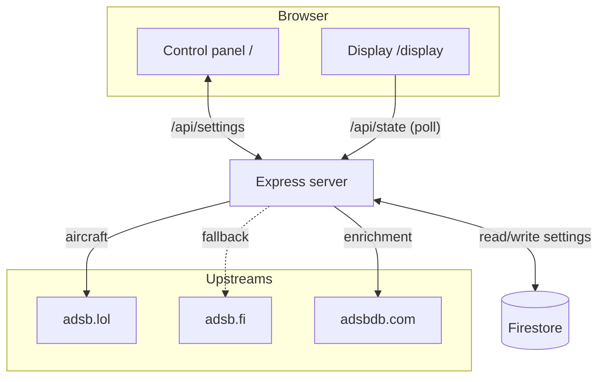
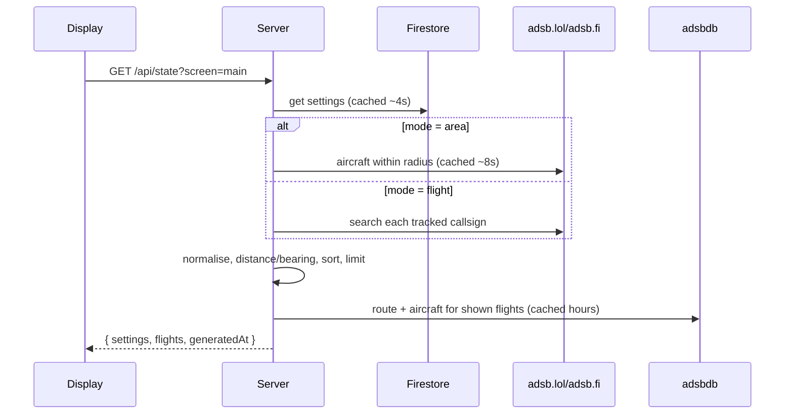
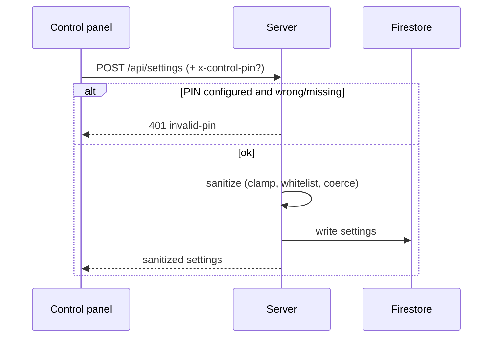

# Architecture

This document explains how Flight Wall is put together and why. For the API shape
see [API.md](API.md); for hardware setup see [DISPLAY_SETUP.md](DISPLAY_SETUP.md).

## Overview

Flight Wall is a single **stateless** Node.js/Express service that serves both the
control panel and the display, exposes a small JSON API, and talks to three free
upstream data sources. Durable state (per-screen settings) lives in Firestore so
any number of instances — and the control panel and display — share one source of
truth.



## Server modules (`src/`)

| Module | Responsibility |
| --- | --- |
| `server.js` | Express wiring: routes, PIN guard, static hosting, error handling, boot. |
| `config.js` | Environment-driven configuration and defaults. |
| `storage.js` | Settings persistence behind one interface; input validation/sanitisation; read cache. |
| `flights.js` | Fetch aircraft, normalise, compute distance/bearing, sort, limit, enrich. |
| `enrich.js` | adsbdb lookups (callsign→route, registration→aircraft) with layered caching. |
| `airlines.js` | Compact ICAO→name and IATA→ICAO tables for offline fallback. |
| `geo.js` | Haversine distance, initial bearing, unit conversions. |
| `http.js` | `fetch` wrapper: timeout, JSON, shared User-Agent, status-aware errors. |

## Key request flows

### Display poll — `GET /api/state`



If the upstreams fail, `/api/state` still returns `200` with an `error` field and
an empty `flights` array, so the display keeps showing its last-known data instead
of going blank.

### Control save — `POST /api/settings`



## Settings model

One document per screen (keyed by a slugified screen id, default `main`):

```jsonc
{
  "screenId": "main",
  "label": "Home",
  "mode": "area",              // "area" | "flight"
  "home": { "lat": 34.05, "lon": -118.24, "label": "Home" },
  "radiusNm": 15,              // 1..250
  "units": "aviation",         // "aviation" | "metric" | "imperial"
  "maxFlights": 5,             // 1..8
  "sort": "distance",          // "distance" | "altitude" | "speed"
  "theme": "departure",        // "departure" | "radar" | "minimal"
  "refreshSec": 10,            // 5..60
  "showRadar": true,
  "trackedFlights": ["UAL245"],// up to 5 (flight mode)
  "updatedAt": 1730000000000
}
```

All writes pass through `sanitizeSettings()`, which whitelists enums, clamps
numbers to safe ranges, validates coordinates, and caps array sizes. Partial
updates are merged over the current values, so the control panel can send only
what changed.

## Storage abstraction

`storage.js` exposes `getScreen`, `saveScreen`, and `listScreens` over one of
three backends, chosen by the `STORAGE` env var (or auto-detected):

- **firestore** — used automatically on Cloud Run (`K_SERVICE` present). Durable
  and shared across instances. If Firestore can't be reached at boot, the server
  logs a warning and falls back to **memory** so it still runs.
- **file** — default locally; writes `./data/screens.json`. Zero setup.
- **memory** — ephemeral; used for tests or as the Firestore fallback.

A short (~4s) read-through cache sits in front of every backend so the display's
frequent polling doesn't translate into a Firestore read every time.

## Caching strategy

Caching keeps responses fast and is courteous to the free upstreams. All caches
are simple in-process maps with timestamps.

| Cache | Key | TTL | Rationale |
| --- | --- | --- | --- |
| Settings | screen id | ~4s | Smooth out rapid display polls. |
| Raw aircraft | lat/lon/radius or callsign | ~8s | ADS-B updates every few seconds; polls are ~10s. |
| Route (adsbdb) | callsign | ~6h (+ negative) | Routes rarely change within a day. |
| Aircraft (adsbdb) | registration | ~24h (+ negative) | Airframe details are static. |

Negative results are cached (shorter TTL) so unknown callsigns/registrations
aren't retried on every poll. Only the aircraft actually shown (after sort+limit)
are enriched, capping enrichment work at `maxFlights` per cycle.

## Enrichment pipeline

For each shown aircraft the server resolves, in parallel:
1. **Route** from the callsign via adsbdb → airline + origin/destination airports.
2. **Aircraft** from the registration via adsbdb → type, model, manufacturer.

If adsbdb has no route, the airline falls back to a name derived from the ICAO
callsign prefix (`airlines.js`). Missing data degrades gracefully — the card shows
what's known (for general aviation, that's often just type and distance).

## Frontend

No build step; plain ES modules load directly in the browser.

- **Shared** (`format.js`, `api.js`) — unit formatting/compass helpers and a thin
  API client, imported by both pages.
- **Display** (`display.js`) — polls `/api/state` and renders the board with
  escaped HTML. The side panel is either a **Leaflet map** (dark tiles served
  through the app's `/api/map` proxy, a range ring, and heading-oriented plane
  markers) or a `<canvas>` **radar**. Each flight shows a per-airline colour, the
  airline logo (`airline-brand.js`, avs.io + monogram fallback), and a type
  silhouette (`aircraft-silhouettes.js`). In flight mode, a Web Audio chime and a
  banner fire when a tracked flight first appears. A local clock ticks every
  second; card typography uses CSS **container queries** (`cqh`) so any number of
  rows fits without scrolling. Kiosk touches: full-screen toggle, cursor
  auto-hide, and last-data retention with a "reconnecting" pill.
- **Tile proxy** (`/api/map/{z}/{x}/{y}`) — validates coordinates, fetches the
  CARTO dark basemap server-side, and caches tiles in-process. Same-origin tiles
  can't be blocked by CDN-targeting ad blockers, so the map is reliable on a
  kiosk.
- **ATC audio** (`atc-audio.js` + `/api/audio-proxy`) — plays configured channels
  through the Web Audio API with per-channel left/center/right panning
  (`StereoPannerNode`). Non-CORS / http feeds are re-streamed same-origin by the
  proxy (allowlisted to that screen's configured URLs; loopback/private hosts
  refused; disconnects handled via `stream.pipeline` so a dropped listener never
  crashes the server). See [ATC_AUDIO.md](ATC_AUDIO.md).
- **Control** (`control.js`) — binds the form to a settings object, handles
  geolocation, tracked-flight rows, and saving (with the optional PIN). The live
  preview is an `<iframe>` of the real display rendered at 1280×720 and CSS-scaled
  to the pane, so it faithfully mirrors a full-size screen rather than the mobile
  layout.

## Security & safety

- **PIN guard**: when `CONTROL_PIN` is set, `POST /api/settings` requires a
  matching `x-control-pin` header (constant-time compared). Reads/display are
  public by design (the display device isn't authenticated).
- **Input sanitisation**: all settings are validated/clamped server-side.
- **Output escaping**: all upstream-derived text is HTML-escaped before insertion
  into the DOM.
- **No secrets in the client**; the server holds no user credentials.

## Deployment topology

- **Cloud Run** runs the container, scaling to zero when idle and up to a small
  max under load. Cold starts are quick (small image, no heavy init).
- **Cloud Build** builds the image from source (`Dockerfile`) on `gcloud run
  deploy --source`.
- **Firestore (Native)** stores settings; the Cloud Run service account needs
  `roles/datastore.user`.
- The service is stateless: any instance can serve any request because all shared
  state is in Firestore and all caches are best-effort.

## Design decisions

- **One service, one deploy** — the display and control panel share a container to
  keep hosting trivial and costs near zero.
- **Free, key-less data** — community ADS-B + adsbdb means no signups or API keys,
  at the cost of best-effort coverage.
- **Server-side enrichment & caching** — clients stay dumb and resilient; the free
  upstreams stay unbothered; multiple displays share one warm cache.
- **Vanilla frontend** — fast on low-power display hardware and dependency-free.
